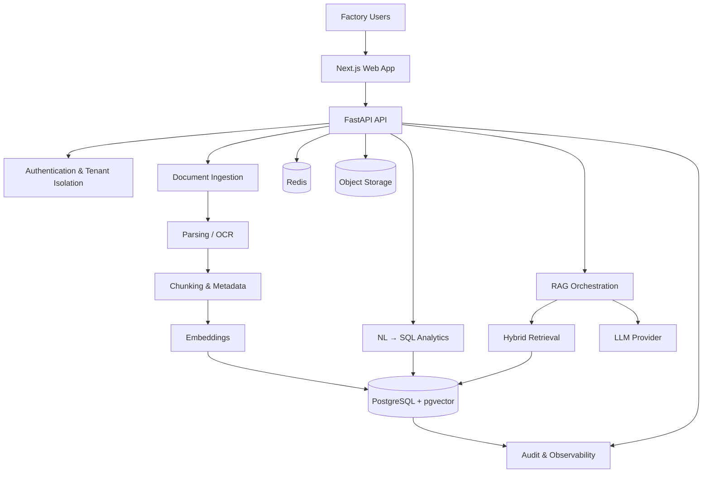

# MIOS — Manufacturing Intelligence OS

<p align="center">
  <strong>Turn factory data into decisions.</strong>
</p>

<p align="center">
  An AI-native intelligence layer for manufacturing operations, built around RAG, structured analytics, and multi-tenant SaaS architecture.
</p>

<p align="center">
  <a href="https://github.com/mnxtr/M_I_OS/stargazers"></a>
  <a href="https://github.com/mnxtr/M_I_OS/network/members"></a>
  <a href="https://github.com/mnxtr/M_I_OS/issues"></a>
  <a href="https://github.com/mnxtr/M_I_OS/blob/main/LICENSE"></a>
</p>

> **Ask your factory anything.**
>
> MIOS connects documents, spreadsheets, production records, quality data, compliance evidence, and operational databases into one searchable intelligence layer. Instead of hunting through PDFs and Excel files, teams can ask questions in natural language and receive answers grounded in their own factory data.

---

## Why MIOS?

Manufacturing organizations rarely have a single clean source of truth. Operational knowledge is distributed across:

- 📄 SOPs and manuals
- 📊 Excel and CSV production sheets
- 🏭 Production and machine records
- 🔍 QC and defect reports
- 📋 Compliance and audit documents
- 💬 Operational messages and email attachments
- 🗄️ ERP and database records

Traditional software often forces factories to replace or restructure these systems before they can extract useful intelligence.

**MIOS takes the opposite approach:** connect the information factories already have, make it searchable, combine it with structured operational data, and put an intelligence layer on top.

---

## Core capabilities

| Capability | What it does |
|---|---|
| **Knowledge Core** | RAG-powered search and Q&A across factory documents with source citations |
| **Production Intelligence** | Natural-language analytics over structured manufacturing data |
| **Compliance Copilot** | Find audit evidence, identify gaps, and accelerate corrective-action preparation |
| **Quality Intelligence** | Retrieve defect history, identify patterns, and support root-cause investigation |
| **Data Ingestion** | Ingest PDF, DOCX, TXT, Markdown, spreadsheets, images, and operational records |
| **Bilingual Intelligence** | English, Bangla, and Banglish query support |
| **Traceability** | Planned lot genealogy and product traceability capabilities |

### Example questions

```text
"Which production line had the highest downtime last month?"

"Show total output by line for order 4821."

"What caused the recurring defects in Line 7?"

"Find the SOP that covers needle-change procedures."

"Which documents provide evidence for this buyer audit requirement?"

"Line 7 er output koto chilo last week?"
```

The goal is not another chatbot. The goal is an **operational intelligence system** that can connect an answer to the underlying factory evidence.

---

## Architecture



### RAG pipeline

```text
Documents / Records
        │
        ▼
   Ingestion Layer
        │
        ├── PDF / DOCX / TXT / MD
        ├── XLSX / XLSM / CSV
        └── Images → OCR
        │
        ▼
Parsing + Normalization
        │
        ▼
Chunking + Metadata
        │
        ▼
Embeddings
        │
        ▼
PostgreSQL + pgvector
        │
        ▼
Query Expansion
        │
        ▼
Hybrid / Multi-Variant Retrieval
        │
        ▼
Context Assembly
        │
        ▼
LLM Generation
        │
        ▼
Cited Answer
```

---

## Product architecture

MIOS is designed as a **multi-tenant SaaS platform**.

```text
Tenant
 ├── Factory
 │    ├── Users & Roles
 │    ├── Documents
 │    ├── Data Tables
 │    ├── Production Records
 │    ├── Quality Records
 │    ├── Compliance Records
 │    └── Conversations
 │
 └── Intelligence Layer
      ├── Retrieval
      ├── Analytics
      ├── Citations
      └── Audit Logs
```

Tenant isolation is treated as a core architectural requirement rather than a UI feature. Database access is designed around PostgreSQL row-level security and explicit tenant context.

---

## Technology stack

### Application

- **Frontend:** Next.js / React / TypeScript
- **Backend:** Python / FastAPI
- **Database:** PostgreSQL
- **Vector search:** pgvector
- **Cache / queue:** Redis
- **Background processing:** Celery / FastAPI background tasks
- **Object storage:** S3-compatible storage / MinIO for local development

### AI

- Retrieval-augmented generation (RAG)
- Embedding-based semantic search
- Query expansion and retrieval fusion
- Natural-language-to-SQL analytics
- OCR-assisted document ingestion
- Pluggable LLM and embedding providers

### Infrastructure

- Docker Compose for local development
- Vercel-compatible web deployment architecture
- PostgreSQL-compatible production database
- CI-ready evaluation and regression testing

---

## Repository structure

```text
M_I_OS/
├── PLAN.md                           # Canonical phased product and delivery plan
├── apps/
│   ├── api/                         # FastAPI backend and intelligence services
│   └── web/                         # Next.js frontend
│
├── packages/
│   └── shared/                      # Shared types, schemas, and contracts
│
├── docs/
│   ├── 01-VISION-AND-PRODUCT.md    # Product vision, users, and modules
│   ├── 02-ARCHITECTURE.md           # System architecture
│   ├── 03-RAG-DESIGN.md             # Retrieval and ingestion design
│   ├── 04-DEVELOPMENT-PLAN.md       # Development roadmap
│   ├── 05-BANGLADESH-GTM.md         # Market and go-to-market strategy
│   ├── 06-FRONTEND-EXPERIENCE-PLAN.md # Frontend UX and implementation roadmap
│   ├── 07-PILOT-BACKEND-AND-PREVIEW.md # Supabase pilot and preview runbook
│   ├── WORKLOG.md                    # Dated implementation and verification log
│   └── adr/                          # Architecture decision records
│
├── evals/                            # Retrieval evaluation datasets and runners
├── infra/
│   └── docker-compose.yml            # Local infrastructure
├── supabase/
│   └── migrations/                    # Hosted pilot schema, seed data, and RLS
│
└── README.md
```

---

## Quick start

### Prerequisites

- Python 3.11+
- Node.js 22+
- Docker + Docker Compose
- Git

Optional for full AI functionality:

- An LLM provider API key
- An embedding provider API key
- Tesseract OCR for scanned documents

### 1. Clone the repository

```bash
git clone https://github.com/mnxtr/M_I_OS.git
cd M_I_OS
```

### 2. Start local infrastructure

```bash
docker compose -f infra/docker-compose.yml up -d
```

This provides the local database, vector-search infrastructure, Redis, and object storage required by the development stack.

### 3. Start the API

```bash
cd apps/api
python3 -m venv .venv
source .venv/bin/activate
pip install -e ".[dev]"
cp .env.example .env
uvicorn app.main:app --reload --port 8000
```

### 4. Start the web application

```bash
cd apps/web
npm install
cp .env.example .env.local
npm run dev
```

Open:

```text
http://localhost:3000
```

For frontend verification, run `npm run lint`, `npm run typecheck`, `npm run build`,
then `npx playwright install chromium` and `npm test` from `apps/web`. The browser suite uses
deterministic pilot data without real credentials. See
[`docs/08-RELEASE-READINESS.md`](docs/08-RELEASE-READINESS.md) for the redesign plan, verified
fixes, and the remaining production requirements.

The shareable pilot frontend uses Supabase Auth, private object storage, and
per-user seed provisioning. Add the hosted project URL and publishable key to
`apps/web/.env.local`; never expose a service-role key in the browser. See
[`docs/07-PILOT-BACKEND-AND-PREVIEW.md`](docs/07-PILOT-BACKEND-AND-PREVIEW.md)
for the full pilot runbook.

### 5. Configure AI providers

For full-quality generation and embeddings, configure the provider settings in `apps/api/.env`.

```env
EMBEDDING_PROVIDER=openai
LLM_PROVIDER=openai
OPENAI_API_KEY=<server-only project key>
OPENAI_MODEL=gpt-5.6-terra
```

The key is read only by FastAPI/Render and must never be placed in a `NEXT_PUBLIC_*` variable or
browser bundle. MIOS uses the Responses API for generation and is also designed to support an
offline development mode using deterministic local embeddings and evidence-only extractive responses
when external model keys are not configured.

---

## Supported data

### Documents

- PDF
- DOCX
- TXT
- Markdown
- Scanned documents via OCR
- PNG / JPG images

### Structured data

- CSV
- XLSX
- XLSM
- PostgreSQL-compatible operational data

Spreadsheet ingestion can expose uploaded data as queryable tables for natural-language analytics.

---

## Natural-language analytics

MIOS can translate operational questions into constrained, read-only SQL queries.

Example:

```text
User:
"What was the total output for each production line last month?"

        ↓

Intent + schema discovery
        ↓

NL → SQL generation
        ↓

SQL validation / guardrails
        ↓

Read-only execution
        ↓

Result + explanation
```

Analytics execution is designed with guardrails such as:

- Read-only database access
- Statement timeouts
- Query limits
- Schema-aware generation
- Tenant-scoped data access

Never expose unrestricted database credentials to an LLM-generated query path.

---

## Bilingual search

MIOS is designed for real-world factory communication, where users may switch between English, Bangla, and Banglish in the same workflow.

Examples:

```text
English:
"What was Line 7's output yesterday?"

Bangla:
"গতকাল লাইন ৭ এর উৎপাদন কত ছিল?"

Banglish:
"line 7 er output koto chilo?"
```

The retrieval layer can use query expansion and multi-variant retrieval to improve recall across these forms.

---

## Retrieval evaluation

MIOS includes a retrieval evaluation workflow intended to catch regressions as the RAG pipeline evolves.

The evaluation framework tracks metrics such as:

- Hit@K
- Mean Reciprocal Rank (MRR)
- Retrieval regression against a baseline

Example:

```bash
MIOS_TEST_DSN=... \
MIOS_EVAL_TENANT_ID=... \
python evals/run_eval.py
```

The objective is simple: **RAG quality should be measured, not declared by vibes.**

---

## Background processing

For development, ingestion can run inline through FastAPI background tasks.

For larger deployments, enable Celery workers:

```bash
USE_CELERY=true
```

Then run:

```bash
cd apps/api
celery -A app.worker worker -l info
```

This allows document ingestion and other long-running workloads to move out of the request lifecycle.

---

## Email ingestion

MIOS can ingest factory information delivered through email workflows.

A typical flow is:

```text
Factory mailbox
      ↓
Inbound connector
      ↓
Secret validation
      ↓
MIME + attachment extraction
      ↓
Document classification
      ↓
RAG ingestion
      ↓
Searchable factory knowledge
```

Attachments such as PDF, XLSX, DOCX, and images can be routed through the same ingestion pipeline.

---

## Security principles

Manufacturing data can contain commercially sensitive information, employee records, buyer information, and compliance evidence. MIOS therefore treats security as part of the product architecture.

Key principles:

- **Tenant isolation** at the database layer
- **Least-privilege database access**
- **Read-only analytics execution**
- **Validated SQL generation**
- **Audit logging** for sensitive operations
- **Secrets stored outside source control**
- **Provider abstraction** to reduce unnecessary data exposure
- **Source citations** so users can inspect the evidence behind answers

Production deployments should additionally implement appropriate encryption, secret management, network controls, backups, monitoring, retention policies, and access reviews.

---

## Development

### Run tests

```bash
cd apps/api
.venv/bin/python -m pytest
```

### Lint

```bash
cd apps/api
.venv/bin/ruff check app tests
```

### Recommended development workflow

```text
Issue
  ↓
Design / ADR
  ↓
Implementation
  ↓
Unit tests
  ↓
Integration tests
  ↓
RAG evaluation
  ↓
Security review
  ↓
Pull request
```

---

## Roadmap

### Phase 1 — Intelligence Core

- [x] Multi-tenant foundation
- [x] Document ingestion architecture
- [x] RAG pipeline foundation
- [x] Citation-aware answers
- [x] Spreadsheet ingestion
- [x] Natural-language analytics architecture
- [x] Bangla / Banglish retrieval design

### Phase 2 — Factory Intelligence

- [ ] Production KPI dashboards
- [ ] OEE intelligence
- [ ] Downtime analysis
- [ ] Quality intelligence
- [ ] Compliance evidence workspace
- [ ] Automated corrective-action workflows

### Phase 3 — Operational Platform

- [ ] ERP connectors
- [ ] Machine / IoT connectors
- [ ] Advanced traceability
- [ ] Lot genealogy
- [ ] Buyer-facing compliance exports
- [ ] Enterprise deployment controls

### Phase 4 — Manufacturing Intelligence Network

- [ ] Cross-site benchmarking with privacy controls
- [ ] Predictive operational intelligence
- [ ] Supply-chain intelligence
- [ ] Digital Product Passport-ready workflows

---

## Product thesis

> **Factories should not need to replace their existing software before they can benefit from AI.**

MIOS is designed as an intelligence layer that sits above the systems factories already use.

The initial wedge is compliance and operational knowledge, where information is often fragmented across documents, spreadsheets, and historical records. From there, the platform expands into production analytics, quality intelligence, traceability, and broader factory operations.

---

## Target market

The initial market focus is Bangladesh's manufacturing sector, particularly export-oriented factories where operational data, compliance requirements, and buyer expectations create a strong need for better information access.

Initial beachhead:

- Ready-made garments (RMG)
- Mid-sized export factories
- Factories operating across multiple production lines
- Organizations with significant document and spreadsheet workflows
- Suppliers exposed to international buyer compliance requirements

The architecture is intentionally broader than RMG and can extend to food, pharmaceuticals, leather, electronics, and other manufacturing verticals.

---

## Contributing

Contributions, issues, architecture discussions, and practical manufacturing use cases are welcome.

Before opening a pull request:

1. Read the relevant architecture documentation.
2. Add or update tests for behavioral changes.
3. Run linting and the relevant evaluation suite.
4. Document significant architectural decisions in `docs/adr/`.
5. Keep tenant isolation and data security in mind when changing data access paths.

---

## License

License information will be added when the project license is finalized.

Until then, the repository should not be treated as granting broad permission to redistribute or commercially reuse the code.

---

## Links

- **Repository:** https://github.com/mnxtr/M_I_OS
- **Issues:** https://github.com/mnxtr/M_I_OS/issues
- **Discussions:** https://github.com/mnxtr/M_I_OS/discussions

---

<p align="center">
  Built to make factory data useful.<br>
  <strong>MIOS — Manufacturing Intelligence OS</strong>
</p>
