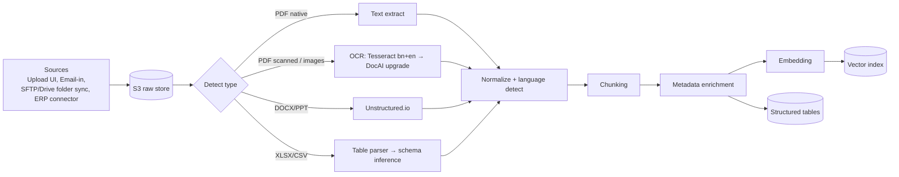

# 03 — RAG Pipeline Design

The RAG pipeline is the product. This doc specifies it precisely enough to build Phase 1.

## 1. Ingestion pipeline

### Chunking strategy (document-type aware)

| Type | Strategy | Target size |
|---|---|---|
| SOPs / manuals | Heading-aware structural split; keep section path in metadata | 400–800 tok |
| Audit reports | Page-level with header/footer stripping; keep finding ID + clause ref | ~page |
| CAPs | Per-finding chunks (finding ↔ evidence ↔ deadline) | small, precise |
| Excel production sheets | NOT chunked as text — parsed into typed tables; text summary row-chunks for keyword recall | rows→SQL |
| Machine manuals (foreign lang.) | Translate-on-ingest to en+bn summaries alongside original | hybrid |

**Metadata envelope on every chunk:** `tenant_id, factory_id, doc_type, department, line/machine refs, product/style codes, date range, language, confidentiality level, source_file, page`.

## 2. Retrieval

- **Hybrid**: dense (multilingual embeddings) + BM25 (`tsvector` with Bangla stemming config or OpenSearch later). Reciprocal Rank Fusion.
- **Reranking**: cross-encoder (`bge-reranker-v2-m3` self-hosted or Cohere) top-40 → top-8.
- **Query understanding layer**:
  - Language ID (Bangla code-mixed queries like "line 7 er efficiency kemon chilo last week?" are the norm — handle transliteration too)
  - Factory glossary expansion (per-tenant alias table: style codes, machine nicknames, department names)
  - Intent router: `doc_lookup | analytics_sql | hybrid | meta` — a cheap fast model classifies
- **Analytics path**: schema-constrained text-to-SQL. LLM sees only the tenant's table DDL + 5 sample rows + glossary. Generated SQL runs read-only, `LIMIT 1000`, timeout 5s, blocked DDL/DML keywords. Errors feed a retry loop once, then graceful fallback to "here's what I can answer…".

## 3. Generation

- System prompt: role-scoped, factory-context-loaded (factory name, active buyer codes), strict citation policy, refusal policy for out-of-corpus questions ("I don't have that in your records" — never hallucinate an audit answer).
- Answers stream via WebSocket with inline citation chips; every claim links to source span (page highlight for PDFs).
- **Answer contract**: `{answer_md, citations[], confidence, sql_used?, suggested_followups[]}`.

## 4. Evaluation (build from day 1)

- **Golden set**: 150+ Q/A pairs harvested during discovery interviews from real factory docs (50% Bangla). Categories: fact retrieval, numeric aggregation, multi-doc reasoning, refusal-required.
- Metrics: retrieval hit-rate@8, citation precision, answer faithfulness (LLM-judged w/ rubric), end-to-end latency p95 (<8s target).
- CI gate: any prompt/retriever change must not regress golden set >2%. Nightly full eval run.

## 5. Cost engineering (critical for BD price points)

| Lever | Tactic |
|---|---|
| Model routing | Cheap model (e.g., GPT-4o-mini / Claude Haiku / Gemini Flash) for classification+simple lookups; frontier model only for synthesis |
| Cache | Semantic answer cache per tenant (embedding similarity >0.97 → serve cached, mark as such) |
| Embeddings | Batch + dedupe by content hash; re-embed only changed chunks |
| OCR | Local Tesseract first pass; expensive DocAI only when confidence < threshold |

Target gross margin ≥70% at Growth tier pricing (~$299/mo/factory, assuming 30k queries/mo).

## 6. Failure modes we design against

1. **Scanned-at-fax-quality PDFs** → aggressive preprocessing (deskew, denoise); flag low-OCR-confidence docs in UI for human review queue.
2. **Excel chaos** (merged cells, Bangla headers, multiple header rows) → interactive column-mapping wizard on first import of each sheet type; mappings saved as templates.
3. **Stale docs** → ingestion requires `valid_from`; expired SOPs auto-flagged and excluded unless user asks for historical.
4. **Cross-language query↔doc mismatch** (Bangla question, English manual) → answer in query language, retrieve across both; cite original + translated snippet.
