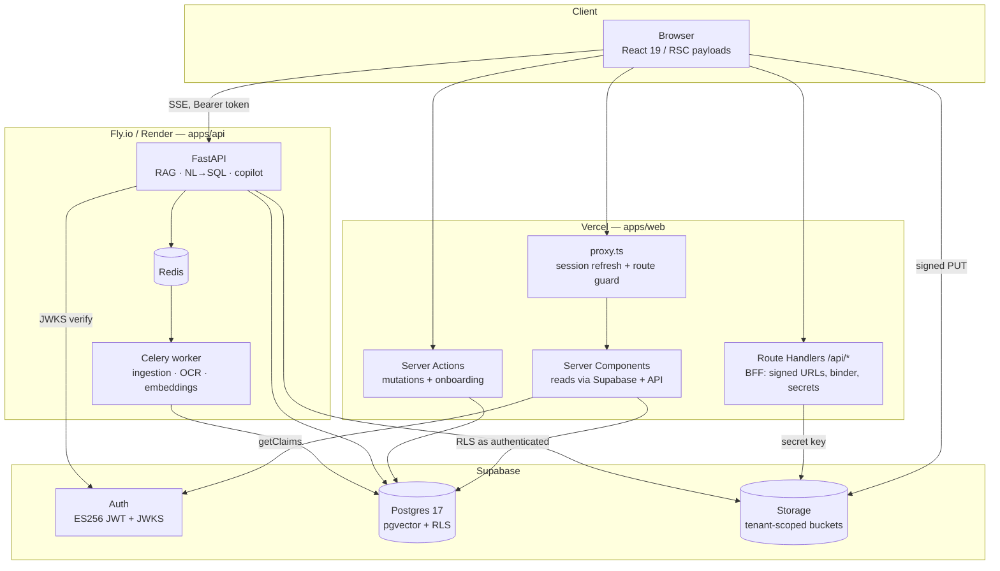

# 06 — Frontend Plan (Next.js on Vercel · Supabase Auth + Database)

**Status:** Proposed · **Created:** 2026-09-03 · **Owner:** web workstream
**Supersedes:** the Vite SPA in `apps/web` · **Amends:** D-2 (see §17, ADR-003 required)

---

## 0. Decisions locked for this plan

| # | Decision |
|---|---|
| F-1 | `apps/web` is rebuilt as a **Next.js App Router** app (current stable: **16.3.4**), deployed to **Vercel** |
| F-2 | **Supabase Auth** is the sole identity provider. FastAPI stops minting JWTs and starts *verifying* Supabase ones |
| F-3 | **Supabase Postgres** (with `pgvector`) is the single database for both Next.js and FastAPI |
| F-4 | **FastAPI stays a long-running service** (Fly.io / Render / Railway) — it owns RAG, OCR, ingestion, Celery, NL→SQL |
| F-5 | **Tailwind v4 + shadcn/ui**, seeded from the existing dark palette in `globals.css` |
| F-6 | **Supabase Storage** replaces local-disk `storage_dir`; browsers upload direct via signed URLs |

> Correction to an earlier framing: `@supabase/ssr` session cookies are **not** `HttpOnly` — `createBrowserClient` has to read them from `document.cookie`. The win over `localStorage` is SSR-readable sessions, correct `Secure`/`SameSite`/`Path` attributes, and server-side revalidation on every request — not XSS-immunity. XSS defence is CSP + no `dangerouslySetInnerHTML` on model output (§14).

---

## 1. Current state audit

### 1.1 What `apps/web` actually is

Not what the README claims. It is a **Vite 6 + React 19 SPA**, 987 lines total:

| File | Lines | Notes |
|---|---:|---|
| `src/pages/WorkspacePage.tsx` | 439 | Knowledge base + chat + analytics + tab switching + usage badge, all in one component, 12 `useState` hooks |
| `src/components/CompliancePanel.tsx` | 267 | Assessments, auto-assess SSE, CAP drafting, binder |
| `src/pages/AuthPage.tsx` | 122 | Login/register tabs, writes `mios_token` to `localStorage` |
| `src/lib/api.ts` | ~430 | Hand-rolled fetch client, 2 bespoke SSE parsers |
| `src/lib/i18n.ts` | ~140 | Hand-rolled `en`/`bn` dictionary, `Dict` type enforces parity |
| `src/styles/globals.css` | 121 | CSS custom properties, dark-only |

Uses `HashRouter` (`/#/workspace`) — no server routing, no SEO, no deep links that a buyer or auditor can be emailed.

### 1.2 Blocking defects found during the audit

These are not stylistic; each one breaks the target deployment.

| # | Finding | Evidence | Impact |
|---|---|---|---|
| **B-1** | **FastAPI has no CORS middleware at all** | no `CORSMiddleware` anywhere in `apps/api/app/` | Every browser→API call from a Vercel origin fails preflight. Also means the current SPA cannot really be working against `:8000` from `:3000` |
| **B-2** | `CREATE EXTENSION IF NOT EXISTS vector` runs on **every new DB connection** | `apps/api/app/db.py:17-21` | Against Supabase the app role is not superuser and `vector` lives in `extensions` — every connection attempt errors |
| **B-3** | `_init_schema()` runs `create_all` + `ALTER TABLE … ENABLE ROW LEVEL SECURITY` + `CREATE INDEX … hnsw` at startup | `apps/api/app/main.py:26-45` | Needs table ownership; will fight Supabase migrations and drift prod schema. Must be env-gated off |
| **B-4** | Auth is FastAPI-minted HS256 with `password_hash` on `public.users` | `app/security.py`, `app/models.py:46` | Directly conflicts with F-2; `users` must become `profiles` keyed to `auth.users.id` |
| **B-5** | RLS policy reads only `current_setting('app.tenant_id')` | `app/models.py:RLS_POLICY` | Supabase clients connect as role `authenticated` and never set that GUC → they'd see **zero rows** (fail-closed, but nothing works) |
| **B-6** | Uploads are multipart through the API, files land on local disk | `app/routers/documents.py:206`, `storage_dir` | Vercel functions cap request bodies at **4.5 MB**; factory PDFs and XLSX regularly exceed it. Local disk dies on every container redeploy |
| **B-7** | `packages/shared` is empty (`.gitkeep` only); no root `package.json`, no workspaces | repo root | Types are duplicated by hand between Pydantic schemas and `lib/api.ts` |

### 1.3 What is worth keeping

- **`lib/api.ts` response types** — they mirror `app/schemas.py` accurately. Promote into `packages/shared`.
- **The `Dict` type trick in `i18n.ts`** (`const bn: Dict = {…}`) — compile-time bn/en key parity. Keep this property in whatever i18n layer replaces it.
- **The CSS custom-property palette** — becomes the Tailwind v4 `@theme` block verbatim.
- **The SSE frame contract** (`data: {"type":"citations"|"token", …}`) — unchanged, just moved behind a shared reader.

---

## 2. Target architecture



### 2.1 Who talks to what, and why

| Path | Used for | Rationale |
|---|---|---|
| RSC → Supabase (role `authenticated`) | Document lists, assessment lists, table metadata, usage, team | Zero extra hop, RLS enforced in the database, no API round-trip on first paint |
| Browser → FastAPI direct (SSE) | `/v1/chat/stream`, `/v1/analytics/query/stream`, `/v1/compliance/…/auto-assess` | **Avoids Vercel function duration limits entirely.** A 40-second grounded answer never touches Vercel |
| Route Handler → Supabase/FastAPI | Signed upload URLs, binder ZIP, document download, bKash init | Anything needing `SUPABASE_SECRET_KEY` or a server-only API key |
| Server Action → Supabase | Onboarding, invites, plan switch, item status patches | Progressive enhancement, no client-side fetch boilerplate |
| Browser → Supabase Storage (signed PUT) | Document upload | Bypasses B-6 entirely; no file byte ever transits Vercel |

**Rule:** Vercel is UI + orchestration. It is never on the critical path of a long-running AI call.

---

## 3. Auth architecture

### 3.1 The tenant-claim problem

MIOS is multi-tenant with RLS. Supabase RLS policies can only read what is *in the JWT*. So `tenant_id` must be a claim — and it must live in `app_metadata` (server-writable only), **never** `user_metadata` (user-writable; a tenant could rewrite it and read another factory's audit evidence).

Mechanism: a **custom access token hook** — a Postgres function Supabase calls when minting every token.

```sql
-- supabase/migrations/xxxx_access_token_hook.sql
create or replace function public.custom_access_token_hook(event jsonb)
returns jsonb
language plpgsql
stable
as $$
declare
  claims jsonb := coalesce(event -> 'claims', '{}'::jsonb);
  app_md jsonb := coalesce(claims -> 'app_metadata', '{}'::jsonb);
  p      record;
begin
  select tenant_id, role into p
  from public.profiles
  where id = (event ->> 'user_id')::uuid;

  if p.tenant_id is not null then
    app_md := app_md
      || jsonb_build_object('tenant_id', p.tenant_id)
      || jsonb_build_object('mios_role', p.role);
  end if;

  return jsonb_set(event, '{claims,app_metadata}', app_md);
end;
$$;

grant execute on function public.custom_access_token_hook to supabase_auth_admin;
revoke execute on function public.custom_access_token_hook from authenticated, anon, public;
```

Enable it in Dashboard → Authentication → Hooks → Customize Access Token.

Consequence to design around: **claims are stale until the token refreshes.** After onboarding sets `tenant_id`, the client must call `supabase.auth.refreshSession()` before any tenant-scoped read, or the user sees an empty workspace. This is the single most common bug in this architecture — put it in the onboarding server action's return path and assert it in an e2e test.

### 3.2 Schema change: `users` → `profiles`

```sql
create table public.profiles (
  id          uuid primary key references auth.users(id) on delete cascade,
  tenant_id   uuid references public.tenants(id),          -- NULL until onboarded
  email       text not null,
  full_name   text not null default '',
  role        user_role not null default 'owner',
  is_active   boolean not null default true,
  created_at  timestamptz not null default now()
);
create index on public.profiles (tenant_id);

-- auto-create a profile row for every new auth user
create or replace function public.handle_new_user()
returns trigger language plpgsql security definer set search_path = '' as $$
begin
  insert into public.profiles (id, email, full_name)
  values (new.id, new.email, coalesce(new.raw_user_meta_data ->> 'full_name', ''))
  on conflict (id) do nothing;
  return new;
end; $$;

create trigger on_auth_user_created
  after insert on auth.users
  for each row execute function public.handle_new_user();
```

`password_hash` is dropped. `app/models.py::User` is renamed to `Profile`, loses `password_hash`, and `app/security.py::hash_password`/`verify_password` are deleted along with `app/routers/auth.py::register`/`login`.

**Existing users:** there are no production tenants yet (per `04-DEVELOPMENT-PLAN.md` §0, "no signed pilots"), so **no password migration is needed**. Dev accounts get recreated. If that changes before cutover, the fallback is `auth.admin.createUser` per row + a forced password-reset email; scrypt hashes cannot be imported into Supabase Auth.

### 3.3 RLS: dual policies, one per connecting role

Both access paths must work, and neither may widen the other. Permissive policies OR together, so scope each with `TO`:

```sql
-- for Supabase clients (RSC, server actions, browser) — role `authenticated`
create policy tenant_isolation_jwt on documents
  for all to authenticated
  using (tenant_id = (auth.jwt() -> 'app_metadata' ->> 'tenant_id')::uuid);

-- for FastAPI — its own dedicated login role, GUC-based (existing mechanism)
create policy tenant_isolation_guc on documents
  for all to mios_api
  using (tenant_id = nullif(current_setting('app.tenant_id', true), '')::uuid);
```

Apply across all of `models.RLS_TABLES` (`documents`, `chunks`, `table_sources`, `table_rows`, `assessments`, `assessment_items`, `guest_tokens`, `monthly_usage`, `payments`) plus new `profiles`/`tenants` policies. `set_tenant()` in `db.py` already uses `set_config(..., true)` (transaction-local), which is Supavisor-safe — keep it.

Create the FastAPI role explicitly; do **not** let FastAPI connect as `postgres` (it bypasses RLS):

```sql
create role mios_api login password '…' noinherit;
grant usage on schema public, extensions to mios_api;
grant select, insert, update, delete on all tables in schema public to mios_api;
-- critically: do NOT grant BYPASSRLS, and do not make it table owner
alter default privileges in schema public grant select, insert, update, delete on tables to mios_api;
```

### 3.4 FastAPI verifies Supabase tokens

Replace `app/security.py::decode_token`:

```python
# apps/api/app/security.py
from functools import lru_cache
import jwt
from jwt import PyJWKClient

@lru_cache
def _jwks() -> PyJWKClient:
    s = get_settings()
    return PyJWKClient(f"{s.supabase_url}/auth/v1/.well-known/jwks.json", cache_keys=True)

def decode_token(token: str) -> dict:
    s = get_settings()
    key = _jwks().get_signing_key_from_jwt(token).key
    return jwt.decode(
        token, key,
        algorithms=["ES256", "RS256"],
        audience="authenticated",
        issuer=f"{s.supabase_url}/auth/v1",
        options={"require": ["exp", "sub", "aud"]},
    )
```

`app/deps.py::get_current_user` then:

```python
payload = decode_token(credentials.credentials)
tenant_id = (payload.get("app_metadata") or {}).get("tenant_id")
if not tenant_id:
    raise HTTPException(403, "User has no tenant — complete onboarding")
profile = db.get(Profile, uuid.UUID(payload["sub"]))
...
set_tenant(db, uuid.UUID(tenant_id))   # claim is the source of truth, not the row
```

JWKS caveat from Supabase docs: keys cache ~10 min at the edge plus ~10 min in-client (≈20 min worst case). Revocation is therefore **not** immediate on the FastAPI path. Mitigation: keep `jwt_expire_minutes` short (15 min access token; Supabase handles refresh) and check `profiles.is_active` on every request — which the existing code already does.

Add `pyjwt[crypto]` to `pyproject.toml` (ES256 needs `cryptography`).

### 3.5 Auth flows to build

| Flow | Supabase primitive | Screen |
|---|---|---|
| Email + password sign-in | `signInWithPassword` | `/login` |
| Email OTP sign-in (**D-5**, now free) | `signInWithOtp` + `verifyOtp` | `/login` → `/verify` |
| Factory registration | `signUp` → trigger → `/onboarding` | `/register` |
| Invite teammate | `auth.admin.inviteUserByEmail` w/ preset `app_metadata.tenant_id` | `/settings/team` |
| Password reset | `resetPasswordForEmail` → `/callback` → `/reset` | `/forgot-password` |
| Auditor guest access | **no Supabase session** — opaque `guest_tokens.token` in the URL | `/guest/[token]` |

D-5 ("OTP-first auth, passwords optional") was scheduled for Phase B as custom endpoints. Supabase Auth delivers email OTP out of the box, so **D-5 lands in Sprint 1 for free** and the planned SMS gateway abstraction reduces to configuring a Supabase SMS provider later.

### 3.6 `proxy.ts` (Next.js 16 renamed `middleware.ts` → `proxy.ts`)

```ts
// apps/web/proxy.ts
import { createServerClient } from '@supabase/ssr'
import { NextResponse, type NextRequest } from 'next/server'

const PUBLIC = ['/', '/pricing', '/login', '/register', '/verify', '/forgot-password', '/callback', '/guest']

export async function proxy(request: NextRequest) {
  let response = NextResponse.next({ request })

  const supabase = createServerClient(
    process.env.NEXT_PUBLIC_SUPABASE_URL!,
    process.env.NEXT_PUBLIC_SUPABASE_PUBLISHABLE_KEY!,
    {
      cookies: {
        getAll: () => request.cookies.getAll(),
        // NOTE: @supabase/ssr >= 0.12 passes cache headers as a 2nd arg.
        // They MUST be copied onto the response or a CDN can cache a Set-Cookie
        // and sign the next visitor in as this user.
        setAll: (cookiesToSet, headers) => {
          cookiesToSet.forEach(({ name, value }) => request.cookies.set(name, value))
          response = NextResponse.next({ request })
          cookiesToSet.forEach(({ name, value, options }) => response.cookies.set(name, value, options))
          Object.entries(headers ?? {}).forEach(([k, v]) => response.headers.set(k, v as string))
        },
      },
    },
  )

  // getClaims(), not getUser() (no round-trip) and never getSession() (spoofable)
  const { data } = await supabase.auth.getClaims()
  const claims = data?.claims
  const { pathname } = request.nextUrl
  const isPublic = PUBLIC.some((p) => pathname === p || pathname.startsWith(p + '/'))

  if (!claims && !isPublic) {
    const url = request.nextUrl.clone()
    url.pathname = '/login'
    url.searchParams.set('next', pathname)
    return NextResponse.redirect(url)
  }

  // onboarding gate: authenticated but no tenant yet
  const tenantId = (claims?.app_metadata as Record<string, unknown> | undefined)?.tenant_id
  if (claims && !tenantId && pathname !== '/onboarding' && !isPublic) {
    const url = request.nextUrl.clone()
    url.pathname = '/onboarding'
    return NextResponse.redirect(url)
  }

  return response
}

export const config = {
  matcher: ['/((?!_next/static|_next/image|favicon.ico|.*\\.(?:svg|png|jpg|webp|woff2)$).*)'],
}
```

Non-negotiables, straight from the Supabase docs:
- **`getClaims()`** to protect pages — verifies the signature locally against cached JWKS.
- **Never `getSession()`** in server code — it reads cookies without revalidating; cookies are spoofable.
- Always return the `response` object the `setAll` closure rebuilt, or refreshed tokens are silently dropped and users get logged out every ~1 hour.

---

## 4. Supabase database & storage

### 4.1 Migration ownership

Two migration systems on one database is a foot-gun. Split by ownership:

| Owns | Tool | Scope |
|---|---|---|
| Supabase CLI (`supabase/migrations/`) | `supabase db push` | `profiles`, triggers, the access-token hook, **all RLS policies**, roles, grants, Storage buckets + policies |
| Alembic (`apps/api/migrations/`) | `alembic upgrade head` | Domain tables MIOS already owns: `documents`, `chunks`, `table_sources`, `table_rows`, `assessments`, `assessment_items`, `guest_tokens`, `monthly_usage`, `payments`, `checklist_templates` |

Fixes for B-2 / B-3, both env-gated so local docker-compose is untouched:

```python
# app/config.py
db_bootstrap: bool = True      # False in staging/prod
create_vector_extension: bool = True   # False on Supabase (pre-installed in `extensions`)
```

```python
# app/db.py — guard the per-connection DDL
if get_settings().create_vector_extension:
    @event.listens_for(engine, "connect")
    def _register_type(dbapi_connection, _record): ...
```

```python
# app/main.py
async def lifespan(_app):
    if get_settings().db_bootstrap:
        _init_schema()
    yield
```

### 4.2 Connection string

Supabase pools through **Supavisor**. Pick deliberately:

| Mode | Port | Use for | Caveat |
|---|---|---|---|
| Session | 5432 | **FastAPI** (SQLAlchemy) | Fewer available connections; fine for a fixed set of app containers |
| Transaction | 6543 | Celery workers, short-lived jobs | Prepared statements unsupported → `?prepare_threshold=0` on psycopg, and no `SET` outside a transaction |

`set_tenant()` uses `set_config(..., is_local=true)` inside the request transaction, so it is safe in either mode. Do not "optimise" that third argument to `false` — a pooled connection would leak one tenant's context into the next request. Add a regression test asserting it.

`DATABASE_URL` for FastAPI: `postgresql+psycopg://mios_api:…@aws-0-<region>.pooler.supabase.com:5432/postgres`

### 4.3 pgvector on Supabase

`vector` is pre-installed in the `extensions` schema. Ensure `search_path` includes it, or fully qualify. The existing HNSW index (`vector_cosine_ops`) is created by `_init_schema` today — move it into an Alembic revision:

```python
op.execute("ALTER TABLE chunks ADD COLUMN IF NOT EXISTS embedding extensions.vector(384)")
op.execute("CREATE INDEX IF NOT EXISTS ix_chunks_embedding ON chunks "
           "USING hnsw (embedding extensions.vector_cosine_ops)")
```

Sizing note: HNSW builds want RAM. On Supabase Micro/Small the index build for a large tenant will be slow or OOM. Budget **Small or larger** for staging and re-check at the ADR-002 (Qdrant) checkpoint.

### 4.4 Storage buckets

| Bucket | Public | Contents |
|---|---|---|
| `documents` | no | Source uploads, path `{tenant_id}/{document_id}/{filename}` |
| `binders` | no | Generated compliance ZIPs, 24 h signed URLs |
| `branding` | no | Tenant logos for binder cover pages |

RLS on `storage.objects` — tenant is the first path segment:

```sql
create policy documents_tenant_rw on storage.objects
  for all to authenticated
  using (
    bucket_id = 'documents'
    and (storage.foldername(name))[1] = (auth.jwt() -> 'app_metadata' ->> 'tenant_id')
  );
```

FastAPI reads objects using `SUPABASE_SECRET_KEY` (bypasses Storage RLS) and enforces tenancy itself from the verified claim — the same trust model it already has for Postgres.

---

## 5. Frontend structure

```
apps/web/
├── app/
│   ├── layout.tsx                       # <html lang>, fonts, theme, Toaster
│   ├── globals.css                      # Tailwind v4 @theme tokens
│   ├── (marketing)/
│   │   ├── page.tsx                     # landing — static, SEO, bn/en
│   │   └── pricing/page.tsx             # plans from /v1/tenant/plans (ISR 1h)
│   ├── (auth)/
│   │   ├── layout.tsx
│   │   ├── login/page.tsx               # password + OTP tabs
│   │   ├── register/page.tsx
│   │   ├── verify/page.tsx              # 6-digit OTP
│   │   ├── forgot-password/page.tsx
│   │   ├── reset/page.tsx
│   │   └── callback/route.ts            # exchangeCodeForSession
│   ├── onboarding/
│   │   ├── page.tsx                     # factory name, lines, language, sample data
│   │   └── actions.ts                   # creates tenant, patches profile, refreshSession
│   ├── (app)/
│   │   ├── layout.tsx                   # sidebar, tenant header, lang toggle, usage meter
│   │   ├── page.tsx                     # → /ask
│   │   ├── ask/page.tsx                 # chat + citations
│   │   ├── knowledge/
│   │   │   ├── page.tsx                 # document table + uploader
│   │   │   └── [documentId]/page.tsx    # viewer, ?page=&chunk= deep link
│   │   ├── analytics/
│   │   │   ├── page.tsx                 # NL→SQL console
│   │   │   └── tables/[tableId]/page.tsx
│   │   ├── compliance/
│   │   │   ├── page.tsx                 # assessments list + create
│   │   │   └── [assessmentId]/page.tsx  # items, evidence, CAP, binder
│   │   ├── quality/page.tsx             # D-4 shell (flagged off)
│   │   └── settings/
│   │       ├── team/page.tsx
│   │       ├── guest-access/page.tsx
│   │       ├── connectors/page.tsx      # email-in secret
│   │       ├── billing/page.tsx         # plan + bKash + invoices
│   │       └── audit-log/page.tsx
│   ├── guest/[token]/
│   │   ├── layout.tsx                   # no app chrome, no Supabase client
│   │   └── page.tsx                     # scoped read-only doc list
│   └── api/
│       ├── documents/sign-upload/route.ts
│       ├── documents/[id]/download/route.ts
│       ├── binder/[assessmentId]/route.ts
│       └── payments/bkash/init/route.ts
├── components/
│   ├── ui/                              # shadcn primitives
│   ├── layout/{Sidebar,TenantHeader,UsageMeter,LangToggle}.tsx
│   ├── chat/{Composer,MessageList,CitationChip,CitationDrawer,StreamingAnswer}.tsx
│   ├── knowledge/{Uploader,DocumentTable,StatusBadge,DocumentViewer}.tsx
│   ├── analytics/{QueryConsole,SqlDisclosure,ResultTable}.tsx
│   └── compliance/{AssessmentCard,ItemTable,StatusPicker,EvidenceList,CapEditor,AutoAssessProgress}.tsx
├── lib/
│   ├── supabase/{client,server,admin}.ts
│   ├── api/{fetcher,sse,chat,documents,analytics,compliance,tenant}.ts
│   ├── i18n/{en,bn,index,useT}.ts
│   └── format.ts                        # bn numerals, dates, BDT
├── proxy.ts
├── vercel.json
└── package.json
```

### 5.1 Route map

| Route | Render | Auth | Data |
|---|---|---|---|
| `/` | Static | public | none |
| `/pricing` | ISR 1 h | public | `/v1/tenant/plans` |
| `/login` `/register` `/verify` | Static + client | public | Supabase Auth |
| `/onboarding` | Dynamic | session, no tenant | server action |
| `/ask` | Dynamic | session + tenant | client SSE → FastAPI |
| `/knowledge` | Dynamic | session + tenant | RSC: Supabase `documents` |
| `/knowledge/[id]` | Dynamic | session + tenant | RSC + signed Storage URL |
| `/analytics` | Dynamic | session + tenant | RSC tables; client SSE for queries |
| `/compliance` | Dynamic | session + tenant | RSC: Supabase `assessments` |
| `/compliance/[id]` | Dynamic | session + tenant | RSC items; client SSE auto-assess |
| `/settings/*` | Dynamic | role-gated | RSC + server actions |
| `/guest/[token]` | Dynamic, `noindex` | token only | `/v1/guest/documents` server-side |

Role gating is UI-level only (hide what a role can't do). Authorization is enforced by RLS and FastAPI; the frontend never asserts it alone.

### 5.2 Monorepo wiring

Add a root `package.json` with npm workspaces so `packages/shared` becomes importable:

```json
{ "private": true, "workspaces": ["apps/web", "packages/*"] }
```

`packages/shared/src/types.ts` holds the API contract lifted from `lib/api.ts`. Keep it honest with a generator: `datamodel-code-generator`-style export from FastAPI's OpenAPI (`/openapi.json`) into TS via `openapi-typescript`, run in CI so drift fails the build. Also generate Supabase types: `supabase gen types typescript --linked > packages/shared/src/database.ts`.

CI change: `.github/workflows/ci.yml` `web` job currently caches `apps/web/package-lock.json` — repoint to the root lockfile and run `npm ci` at root.

---

## 6. Design system

### 6.1 Tokens — port the existing palette

```css
/* apps/web/app/globals.css */
@import "tailwindcss";

@theme {
  --color-bg: #0f1115;
  --color-panel: #171a21;
  --color-border: #2a2f3a;
  --color-fg: #e8eaed;
  --color-muted: #9aa3b2;
  --color-accent: #4f8cff;
  --color-accent-dark: #3a6fd8;
  --color-danger: #e5544b;
  --color-ok: #3fbf6f;
  --color-warn: #e2b93b;

  --font-sans: var(--font-inter), "Noto Sans", system-ui, sans-serif;
  --font-bengali: var(--font-noto-bengali), "Noto Sans Bengali", sans-serif;

  --radius-panel: 10px;
}
```

Tailwind v4 is CSS-first — no `tailwind.config.js`. Install `tailwindcss@4.3.3` + `@tailwindcss/postcss`.

Dark is the product's default and only theme for v1. Add `light` later behind `@custom-variant`; don't spend Sprint 1 on it.

### 6.2 shadcn/ui components to install

`button` `input` `textarea` `select` `dialog` `sheet` `dropdown-menu` `tabs` `table` `badge` `card` `skeleton` `toast` `tooltip` `command` `progress` `alert` `separator` `avatar` `popover` `calendar` `form`

Highest-value ones for this product: **`table`** (analytics results, assessment items), **`sheet`** (citation drawer), **`command`** (⌘K jump to document/assessment/line), **`progress`** (auto-assess).

### 6.3 Bilingual typography

The current stack string already carries `"Noto Sans Bengali"`. Formalise it:

```ts
// app/layout.tsx
import { Inter, Noto_Sans_Bengali } from 'next/font/google'
const inter = Inter({ subsets: ['latin'], variable: '--font-inter', display: 'swap' })
const bengali = Noto_Sans_Bengali({ subsets: ['bengali'], variable: '--font-noto-bengali', display: 'swap' })
```

Bangla-specific rules that will otherwise bite:
- **Line-height**: Bengali conjuncts need `leading-relaxed` (~1.65) minimum; the Latin default clips ঁ and ূ.
- **Numerals**: factory users read `৭` for Line 7 but SQL returns `7`. One helper, `formatNumber(n, lang)`, used by every table cell and KPI tile. Never localise numerals inside SQL or citation refs.
- **Mixed-script strings** are normal ("Line ৭ er output"). Set `--font-sans` to a stack containing both; don't switch fonts per-element.
- `<html lang={lang}>` must be set server-side in the root layout from a cookie, not client-side after hydration — otherwise screen readers announce Bangla with an English voice on first paint.

---

## 7. Data fetching & state

| Concern | Choice |
|---|---|
| First-paint reads | **RSC** querying Supabase with the request-scoped server client |
| Mutations | **Server Actions** + `revalidatePath` — no client fetch code for status patches, plan switch, invites |
| Streaming AI | **Client component** → `fetch` to FastAPI with `Authorization: Bearer <access_token>` from `supabase.auth.getSession()` (the one legitimate `getSession()` use: extracting a raw token to forward) |
| Polling (ingestion status) | **Supabase Realtime** on `documents` filtered by `tenant_id`, falling back to 5 s `router.refresh()` |
| Client cache | `@tanstack/react-query@5.102.8`, **only** in the chat/analytics/compliance interactive surfaces. Do not wrap RSC data in it |
| Forms | `react-hook-form@7.87.0` + `zod@4.5.4`, schemas shared with server actions |

Deliberately excluded: Redux/Zustand/Jotai. State here is server state plus per-panel local state; a global store would duplicate what RSC + React Query already own. Adding one requires an ADR per §3 of the development plan.

### 7.1 One shared SSE reader

`lib/api.ts` has two near-identical hand-rolled parsers today. Collapse to one, and fix the bug both share — neither handles a `data:` frame split across chunk boundaries at the `data: ` prefix, nor multi-line frames:

```ts
// lib/api/sse.ts
export async function* sseFrames(res: Response): AsyncGenerator<unknown> {
  if (!res.body) return
  const reader = res.body.getReader()
  const decoder = new TextDecoder()
  let buf = ''
  for (;;) {
    const { done, value } = await reader.read()
    if (done) break
    buf += decoder.decode(value, { stream: true })
    let idx: number
    while ((idx = buf.indexOf('\n\n')) !== -1) {      // split on event boundary, not line
      const frame = buf.slice(0, idx)
      buf = buf.slice(idx + 2)
      const data = frame.split('\n').filter((l) => l.startsWith('data:'))
        .map((l) => l.slice(5).trim()).join('\n')
      if (data) { try { yield JSON.parse(data) } catch { /* ignore */ } }
    }
  }
}
```

Consumers narrow by `type`: `citations` → drawer, `token` → append, `{type:'item', ref, status}` → progress. Server side, FastAPI must terminate every frame with `\n\n` (verify each of the three stream endpoints) and send `X-Accel-Buffering: no`.

---

## 8. Screen specifications

### 8.1 `/login`, `/register`, `/verify`
Two tabs: **Password** and **Email code** (D-5). Register collects factory name + full name + email + password; on success routes to `/onboarding`. Errors map Supabase codes to bn/en copy — never surface `AuthApiError` text raw. Rate-limit feedback ("try again in 47s") from Supabase's 429 body.

### 8.2 `/onboarding`
Three steps, resumable, `tenant_id`-null users are forced here by the proxy.
1. Factory profile — name, location, production lines, primary language.
2. First upload — drop 1–3 SOPs, or **"Explore with sample data"** which seeds a demo tenant (`compliance_seed.py` already exists).
3. First question — prefilled prompt so the user sees a cited answer inside 3 minutes.

Server action creates `tenants` row + patches `profiles.tenant_id`, then **`refreshSession()`** (§3.1) before redirecting to `/ask`.

### 8.3 `/knowledge`
- Uploader: drag-drop, multi-file, per-file progress, `Uppy`-free (native `XMLHttpRequest` for progress events; `fetch` has no upload progress). Flow in §10.
- Table: filename · type · department · language · status badge · pages · uploaded. Server-side filters by type/department/status, search on filename.
- Realtime status: `processing → ready | failed`, with the `error` column shown in a tooltip on failure.
- Row actions: view, download (signed URL), re-ingest, delete.
- Empty state keeps the existing copy (`noDocsYet`) — it already names the right artifacts (SOPs, audit reports, production sheets).

### 8.4 `/ask` — the core screen
Split view: conversation left, **citation drawer** right.
- Streaming answer with a caret; `Stop` aborts via `AbortController`.
- Citations render as numbered chips `[1]`; hover shows the snippet, click opens the drawer, drawer "Open document" deep-links `/knowledge/[id]?page=3&chunk=17`. **This is the product's core promise (principle #1, citations always) — treat the deep link as a P0 requirement, not polish.**
- `provider` from `ChatOut` shown as a subtle footer badge, so extractive-fallback mode is visible rather than silently degraded.
- Suggested prompts seeded from the existing `tryPrompt` strings.
- Thumbs up/down per answer → writes to a new `answer_feedback` table; feeds the weekly quality review (§5 of the development plan).
- Language: composer accepts bn/en/Banglish unchanged; no client-side transliteration (the API's `query_understanding.py` owns that).

### 8.5 `/analytics`
- Table picker (from `/v1/analytics/tables`) + NL question box.
- Result table: virtualized past 200 rows, sortable, CSV export client-side.
- **`SqlDisclosure`**: collapsed by default, shows the generated SQL verbatim. Non-negotiable for trust — and it makes `sqlguard` failures debuggable by the user.
- Guardrail errors (timeout, row-limit, rejected statement) get explicit, non-scary copy in bn/en.
- Empty state = the existing `analyticsHint` (upload a sheet first) with a direct link to `/knowledge`.

### 8.6 `/compliance` + `/compliance/[id]`
- List: template, title, due date, status, and a stacked count bar from `AssessmentOut.counts`.
- Create: template select (`/v1/compliance/templates`), title, due date.
- Detail: item table grouped by `category`, `ref` · title · status picker · evidence count. Selecting a row opens the evidence panel (`ai_notes`, citations, CAP editor).
- **Auto-assess**: `Progress` bar driven by the SSE `{type:'item', ref, status}` frames; rows update live; user can leave and return (status persisted server-side).
- **Manual override wins** (principle #4): a `manually_set` item shows a lock icon and is never overwritten by re-running auto-assess. Surface this explicitly in the UI.
- CAP editor: `Draft CAP` calls the endpoint, result lands in an editable textarea, saved via server action.
- **Binder**: route handler streams the ZIP with `Content-Disposition`, or better — FastAPI writes to the `binders` bucket and returns a 24 h signed URL, so a 200 MB binder never streams through Vercel.

### 8.7 `/guest/[token]`
No Supabase client on this route. Server-side call to `/v1/guest/documents` with the path token. No app chrome, no navigation into the tenant, `<meta name="robots" content="noindex,nofollow">`, and a visible expiry banner. An auditor with the link must not be able to reach anything else — assert with a Playwright test that hits `/knowledge` from a guest context and expects a redirect to `/login`.

### 8.8 `/settings/*`
- **team** — invite (role select), list, deactivate, role change. Owner/admin only.
- **guest-access** — create scoped expiring link (all docs vs. picked docs), copy, revoke. Show remaining validity.
- **connectors** — reveal/rotate the email-in secret; show the inbound address; last-received timestamp.
- **billing** — current plan, usage bars vs. limits, **minutes-saved ledger** (`estimated_minutes_saved`, the ROI-visible-daily principle), plan switch, bKash checkout, invoice PDF list.
- **audit-log** — Phase-A security deliverable; needs the backing table to exist first. Ship the page behind a flag.

---

## 9. Internationalisation

Keep the current architecture's best property — **compile-time key parity** — and fix its two real limits (no server rendering, no pluralisation/interpolation).

```
lib/i18n/
├── en.ts          # export const en = { … } as const
├── bn.ts          # export const bn: typeof en = { … }   ← parity enforced by tsc
├── index.ts       # getDict(lang), cookie read/write
└── useT.ts        # client hook
```

- Lang lives in a **cookie** (`mios_lang`), read in the root layout so `<html lang>` and the correct font are right on first byte. Migrate the existing `localStorage` key on first load.
- Server components take `lang` from the cookie; client components use `useT()`.
- Keep the existing function-valued entries (`sources: (n) => …`) — they already cover interpolation without a runtime.
- `next-intl` is **not** needed for two locales and would cost a routing rewrite. Revisit only if a third locale (Hindi/Vietnamese, Phase D regional scouting) appears — that is the ADR trigger.
- CI check: a test that asserts `Object.keys(en)` deep-equals `Object.keys(bn)` for nested objects, so a missing translation fails the build rather than rendering an English string to a Bangla-speaking supervisor.

---

## 10. Upload flow (fixes B-6)

```
Browser                    Vercel Route Handler         Supabase Storage        FastAPI
  │  POST /api/documents/sign-upload
  │  {filename, size, contentType}
  │──────────────────────────►│
  │                           │ verify claims, check plan quota
  │                           │ createSignedUploadUrl(
  │                           │   `${tenant_id}/${uuid}/${name}`)
  │                           │────────────────────────────►│
  │◄──────────────────────────│  {signedUrl, path, token}
  │
  │  PUT signedUrl  (raw bytes, XHR progress events)
  │───────────────────────────────────────────────────────►│
  │
  │  POST {API}/v1/documents/register  {storage_path, filename, doc_type, department}
  │───────────────────────────────────────────────────────────────────────────────►│
  │◄─── 202 {document_id, status: processing} ─────────────────────────────────────│
  │
  └── Realtime subscription on documents → status: ready
```

Why this shape:
- **No file byte crosses Vercel** → the 4.5 MB function body limit is irrelevant; a 200 MB scanned audit binder uploads fine.
- Quota is checked *before* the signed URL is issued, so plan limits can't be bypassed by PUTing directly.
- FastAPI needs a **new endpoint**: `POST /v1/documents/register` taking a storage path instead of `UploadFile`. It fetches the object with the secret key, then reuses `create_and_store_document` unchanged. Keep the multipart endpoint for CLI/curl and tests.
- Signed upload URLs are short-lived (2 min) and single-use; the path is server-chosen so a client can't write into another tenant's folder even if Storage RLS were misconfigured (defence in depth).

---

## 11. Environment variables

### Vercel (`apps/web`)

| Var | Scope | Notes |
|---|---|---|
| `NEXT_PUBLIC_SUPABASE_URL` | all | |
| `NEXT_PUBLIC_SUPABASE_PUBLISHABLE_KEY` | all | current Supabase naming (was `ANON_KEY`) |
| `SUPABASE_SECRET_KEY` | server only | **never** prefix `NEXT_PUBLIC_`. Signed URLs, admin invites |
| `NEXT_PUBLIC_API_URL` | all | FastAPI public origin — browser SSE targets it |
| `API_INTERNAL_URL` | server only | private URL if the host offers one |
| `NEXT_PUBLIC_SITE_URL` | all | Supabase redirect allow-list must match |
| `SENTRY_DSN` / `NEXT_PUBLIC_SENTRY_DSN` | both | |

Preview deployments get their own Supabase **branch** database (Supabase branching) so a preview PR can never write to production tenant data. Add every `*.vercel.app` preview pattern to the Supabase Auth redirect allow-list, or OAuth/OTP callbacks silently fail on previews.

### FastAPI host

`DATABASE_URL` (Supavisor session-mode, role `mios_api`) · `SUPABASE_URL` · `SUPABASE_SECRET_KEY` · `SUPABASE_JWT_AUDIENCE=authenticated` · `ALLOWED_ORIGINS` · `DB_BOOTSTRAP=false` · `CREATE_VECTOR_EXTENSION=false` · `OPENAI_API_KEY` · `REDIS_URL` · `USE_CELERY=true` · `PUBLIC_BASE_URL` (bKash callbacks → the Vercel domain) · bKash credentials.

Deletions: `JWT_SECRET`, `JWT_ALGORITHM`, `JWT_EXPIRE_MINUTES` (Supabase owns tokens now), `STORAGE_DIR` (Storage owns files).

---

## 12. Vercel deployment

**Project settings:** Root Directory `apps/web`, "Include files outside root directory" **on** (needs `packages/shared`), framework preset Next.js, Node 22.

```json
// apps/web/vercel.json
{
  "$schema": "https://openapi.vercel.sh/vercel.json",
  "framework": "nextjs",
  "regions": ["sin1"],
  "headers": [
    {
      "source": "/(.*)",
      "headers": [
        { "key": "X-Content-Type-Options", "value": "nosniff" },
        { "key": "Referrer-Policy", "value": "strict-origin-when-cross-origin" },
        { "key": "X-Frame-Options", "value": "DENY" },
        { "key": "Permissions-Policy", "value": "camera=(), microphone=(), geolocation=()" },
        { "key": "Strict-Transport-Security", "value": "max-age=63072000; includeSubDomains; preload" }
      ]
    },
    { "source": "/guest/(.*)", "headers": [{ "key": "X-Robots-Tag", "value": "noindex, nofollow" }] }
  ]
}
```

`regions: ["sin1"]` (Singapore) — nearest Vercel region to Dhaka; put the Supabase project and the FastAPI host in the same region so the three hops don't cross oceans.

**Ignored build step** so API-only commits don't redeploy the web app:
```bash
git diff --quiet HEAD^ HEAD -- apps/web packages/shared || exit 1; exit 0
```

**CI change** — add a `web` job step for `next build` from root workspaces, plus `tsc --noEmit`, `eslint`, `vitest run`, and a Playwright job against the Vercel preview URL (`vercel-deployment-url` from the GitHub deployment event).

---

## 13. FastAPI prerequisites owned by this workstream

The frontend cannot ship without these. They are backend edits, listed here because they block web delivery.

| # | Change | File | Blocks |
|---|---|---|---|
| A-1 | Add `CORSMiddleware`: prod domain, `https://*-<scope>.vercel.app` preview regex, `localhost:3000`; `allow_credentials=False`; expose `Content-Disposition` | `app/main.py` | **everything** (B-1) |
| A-2 | JWKS verification, `app_metadata` claim extraction | `app/security.py`, `app/deps.py` | login (B-4) |
| A-3 | `users` → `profiles`, drop `password_hash`, delete register/login routes | `app/models.py`, `app/routers/auth.py` | login (B-4) |
| A-4 | Env-gate `_init_schema` and the per-connection `CREATE EXTENSION` | `app/main.py`, `app/db.py` | any Supabase connection (B-2/B-3) |
| A-5 | Second RLS policy per table `TO authenticated` using `auth.jwt()` | `app/models.py` + Supabase migration | all RSC reads (B-5) |
| A-6 | `POST /v1/documents/register` (storage path, not multipart) | `app/routers/documents.py` | uploads (B-6) |
| A-7 | Storage-backed document read/write via `SUPABASE_SECRET_KEY` | `app/services/parsers.py`, documents router | uploads, viewer |
| A-8 | Binder → `binders` bucket + signed URL response | `app/routers/compliance.py` | binder download |
| A-9 | Verify all three SSE endpoints emit `\n\n`-terminated frames + `X-Accel-Buffering: no` | chat, analytics, compliance routers | streaming |
| A-10 | `pyjwt[crypto]`; drop scrypt helpers | `pyproject.toml`, `app/security.py` | login |

---

## 14. Security checklist

- [ ] `SUPABASE_SECRET_KEY` appears in **zero** files under `app/` or `components/` — enforce with an ESLint `no-restricted-imports` rule on `lib/supabase/admin.ts` outside `app/api/**` and `**/actions.ts`, plus the existing gitleaks CI job.
- [ ] `tenant_id` is read **only** from `app_metadata`. A grep test asserting no `user_metadata.tenant_id` usage anywhere.
- [ ] RLS negative tests: authenticate as tenant A, attempt reads of tenant B rows across all nine `RLS_TABLES` — expect 0 rows. Run in CI against a Supabase branch.
- [ ] Storage negative test: signed PUT into `{other_tenant}/…` → 403.
- [ ] Guest route reaches nothing outside its token scope (Playwright).
- [ ] **Never `dangerouslySetInnerHTML`** on LLM output. Answers render as text; if markdown is wanted, `react-markdown` with a strict allow-list and no raw HTML plugin.
- [ ] CSP header: `default-src 'self'; connect-src 'self' <supabase> <api> https://*.sentry.io; img-src 'self' data: blob: <supabase>; script-src 'self' 'unsafe-inline'` — measure with `Content-Security-Policy-Report-Only` for one sprint before enforcing.
- [ ] `next.config.ts`: `poweredByHeader: false`.
- [ ] Supabase Auth: leaked-password protection on, OTP expiry ≤ 10 min, redirect allow-list restricted to known domains.
- [ ] Rate limiting on FastAPI (Phase-A deliverable) — Supabase covers auth endpoints only, not `/v1/chat`.
- [ ] SQL from `sqlguard` is displayed, never executed client-side.
- [ ] No tenant name, document title, or citation snippet in Sentry breadcrumbs — scrub before send.

---

## 15. Testing

| Layer | Tool | Coverage |
|---|---|---|
| Unit | Vitest + Testing Library | SSE reader (split frames, malformed JSON, abort), `formatNumber` bn/en, i18n parity, citation deep-link builder, zod schemas |
| Component | Vitest + jsdom | Uploader states, StatusPicker with `manually_set` lock, StreamingAnswer incremental render |
| E2E | Playwright | register → onboard → upload → ready → ask → citation → open doc; create assessment → auto-assess → CAP → binder; guest-link scoping; language switch persists across reload |
| a11y | `@axe-core/playwright` | Zero serious/critical on `/ask`, `/knowledge`, `/compliance/[id]`, `/login` |
| Perf | Lighthouse CI on preview | budgets in §16 |
| Security | RLS negative suite (pytest, Supabase branch) | §14 |

Playwright runs against the Vercel **preview** URL with a dedicated Supabase branch and a seeded test tenant — not against localhost, because the proxy/cookie/CDN interactions in §3.6 only misbehave in a real edge environment.

---

## 16. Performance budgets

| Metric | Budget | Where |
|---|---|---|
| LCP | < 2.0 s on 3G Fast | `/` and `/login` |
| First answer token | < 1.5 s after submit | `/ask` (streaming perceived latency; end-to-end p95 stays the existing < 8 s SLO) |
| Route JS (gzip) | < 180 KB per app route | Lighthouse CI |
| Document table | 500 rows without jank | virtualize past 100 |
| Analytics results | 1 000 rows (`analytics_result_limit`) | virtualize past 200 |

Levers: RSC for all lists (no client-side data libs on first paint), `next/dynamic` for the PDF viewer and result table, `next/font` self-hosting for both scripts, Bengali subset only.

Also budget for reality: many target users are on shared 3G/4G in an industrial area. Test on a throttled profile, keep an optimistic-UI path for status patches, and make every failed request retryable rather than fatal.

---

## 17. Risks & open decisions

| Risk | Severity | Mitigation |
|---|---|---|
| **D-2 conflict — data residency.** D-2 accepted "production in a Dhaka data centre; buyer-sensitive docs never leave the country" as *the trust wedge for R2*. Supabase has **no Bangladesh region** (nearest: Singapore / Mumbai). Vercel has none either. This plan therefore contradicts an accepted decision on the exact axis the GTM story is sold on. | **High** | **Write ADR-003 before Sprint 1** and pick explicitly: (a) amend D-2 — Supabase Singapore, disclose in the DPA, accept the weaker residency pitch; (b) keep D-2 — self-hosted Supabase or plain Postgres in the Dhaka DC, and treat "Supabase" here as the *API surface* only (Supabase Auth still needs their cloud, so this variant means keeping in-house auth); (c) hybrid — Supabase for auth/metadata, documents and chunks stay in the Dhaka DC. This is a **founder/GTM decision, not an engineering one** — flag it before code is written, because (b) invalidates F-2 |
| FastAPI cold starts on Render/Fly free tiers | Medium | Fly with `min_machines_running = 1`; health-check ping; chat p95 < 8 s SLO makes a 20 s cold start unacceptable |
| Vercel function duration on any accidental proxying of AI calls | Medium | Architectural rule (§2.1): browser talks to FastAPI directly for all SSE. Add a lint rule banning `NEXT_PUBLIC_API_URL` inside `app/api/**` chat paths |
| Stale `tenant_id` claim after onboarding | Medium | Forced `refreshSession()` + e2e assertion (§3.1) |
| JWKS cache delays revocation up to ~20 min | Medium | Short access tokens + `profiles.is_active` check per request |
| Supavisor transaction mode breaks prepared statements | Medium | Session mode for FastAPI; `prepare_threshold=0` for workers; documented in `.env.example` |
| HNSW build OOM on small Supabase compute | Medium | Small+ instance for staging; revisit at ADR-002 Qdrant checkpoint |
| Two migration systems drift | Medium | Strict ownership split (§4.1); CI check that Alembic head applies cleanly to a fresh Supabase branch |
| Bangla layout regressions from Tailwind's Latin defaults | Low | Visual-regression snapshots in both languages on `/ask` and `/compliance/[id]` |
| Supabase pricing at scale (Storage egress for binders) | Low | Signed URLs served from Storage CDN; monitor from Sprint 4 |

**ADRs to write:** ADR-003 (Vercel + Supabase hosting; amends D-2) · ADR-004 (Supabase Auth supersedes in-house JWT; subsumes D-5) · ADR-005 (Next.js 16 App Router + Tailwind v4/shadcn; updates the "Next.js 15/React 19" line in `04-DEVELOPMENT-PLAN.md` §3).

---

## 18. Execution plan

Six sprints, one week each, assuming one full-time frontend engineer with backend help for §13. Each gate is verified **on a Vercel deployment**, not localhost.

### Sprint 0 — Foundations
Supabase project (Singapore) + branching · root `package.json` workspaces · Next.js 16 scaffold in `apps/web` (old Vite app moved to `apps/web-legacy`, deleted at Sprint 5) · Tailwind v4 tokens ported · shadcn init + component install · `packages/shared` with generated API + DB types · Vercel project wired, marketing page live · CI updated for root workspaces.
**Gate:** `https://<preview>.vercel.app` renders the landing page in bn and en; `tsc --noEmit` and `next build` green in CI.

### Sprint 1 — Auth & tenancy *(highest risk — do it second, not last)*
Supabase migrations: `profiles`, trigger, access-token hook, `mios_api` role, dual RLS policies on all nine tables · A-1 through A-5 and A-10 on the API · `proxy.ts` guard · `/login` (password + OTP) · `/register` · `/verify` · `/callback` · `/onboarding` + `refreshSession` · `/settings/team` invites.
**Gate:** register → onboard → `GET /v1/auth/me` returns 200 from a Vercel prod deployment using a Supabase-issued ES256 token; RLS negative suite green; tenant A provably cannot read tenant B.

### Sprint 2 — Knowledge base & ingestion
App shell (sidebar, tenant header, lang toggle, usage meter) · Storage buckets + policies · A-6/A-7 · sign-upload route handler with quota pre-check · uploader with real progress · document table + filters + Realtime status · document viewer with `?page=&chunk=` anchors.
**Gate:** a 50 MB scanned PDF uploads from the production domain, reaches `ready`, and its page 12 is deep-linkable.

### Sprint 3 — Ask
Shared SSE reader · A-9 · chat with streaming, abort, citation chips, citation drawer, deep links · provider badge · answer feedback · suggested prompts · full bn/en parity on every string added so far.
**Gate:** streaming answer renders incrementally with working citations; no truncation at 60 s; i18n parity test green.

### Sprint 4 — Analytics & Compliance Copilot
Analytics console, SQL disclosure, virtualized results, CSV export, guardrail error copy · assessments list/create · item table with grouped categories and `manually_set` lock · evidence panel · auto-assess progress via SSE · CAP editor · A-8 binder via signed URL.
**Gate:** create assessment → auto-assess completes with live row updates → CAP drafted and saved → binder ZIP downloads from a signed Storage URL.

### Sprint 5 — Settings, guest, billing, hardening
Guest portal (`/guest/[token]`) · guest-access management · connectors page · billing (plan, usage bars, minutes-saved, bKash init, invoices) · audit-log page behind a flag · Sentry · a11y pass · Lighthouse budgets · full Playwright suite in CI · CSP report-only → enforce · delete `apps/web-legacy` · update README (it currently claims Next.js — make that true) and `04-DEVELOPMENT-PLAN.md` §3/§4.
**Gate:** every §15 suite green in CI; §16 budgets met; zero serious axe violations; README matches reality.

### Cutover & rollback
No production tenants exist, so cutover is a DNS/domain switch with no data migration. Rollback = re-point the Vercel domain at the last good deployment (instant, Vercel keeps every build) and revert the FastAPI image tag. The irreversible step is the Supabase Auth migration in Sprint 1 — take a `pg_dump` of the pre-migration database and keep it until Sprint 5 closes.

---

## 19. Definition of done

1. A factory owner registers, onboards, uploads a real SOP, and gets a **cited** answer in Bangla — on the production domain, on a throttled 3G profile, in under 5 minutes.
2. An auditor opens a scoped guest link, sees only the shared documents, and can reach nothing else (test-enforced).
3. Tenant A cannot read one row of tenant B through any path: RSC, browser Supabase client, FastAPI, or Storage (test-enforced across all nine RLS tables).
4. Every user-facing string exists in both `en` and `bn`, enforced at compile time and in CI.
5. No secret is reachable from client bundles; gitleaks and the ESLint boundary rule both pass.
6. ADR-003 is written and signed off — the residency question in §17 is **answered**, not deferred.
7. `README.md` and `04-DEVELOPMENT-PLAN.md` §3–§4 describe the stack that actually ships.
