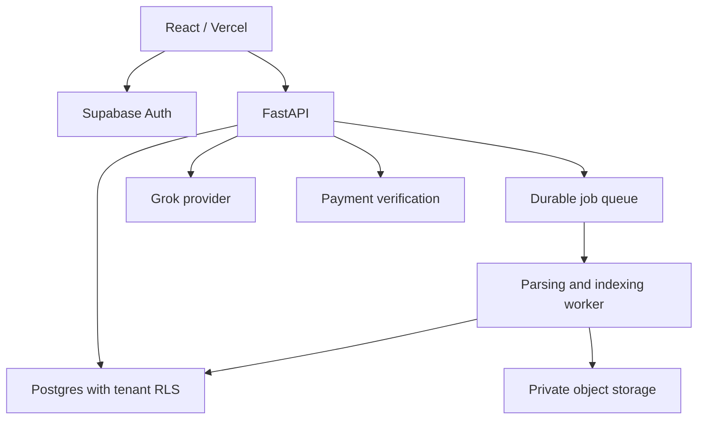

# Linora: operations-first SaaS and market entry

Planning assumptions: the requested belts mean **Gazipur** and **Savar**, Bangladesh; “IMG” is
interpreted as **RMG**; “Bicar” as **bKash**; “SSL payment” as **SSLCOMMERZ**. Confirm these in
commercial discovery. This is a product strategy, not a forecast of revenue or demand.

## Where to start

Mapped in Bangladesh's directory returned 1,124 factories for Gazipur district and 556 for
Savar Upazila on 2026-09-07. These are different administrative boundaries and directory
coverage, not comparable density measurements, active buyers, or total addressable revenue.

Sources: [Gazipur directory](https://mappedinbangladesh.org/search?district=Gazipur),
[Savar directory](https://mappedinbangladesh.org/search?upazilla=Savar+Upazila).

**Recommendation, as an inference:** start Gazipur outreach because it offers a substantial
prospect list, with a Savar pilot in parallel if local relationships reduce acquisition and
support effort. The directory does not establish that either belt needs Linora more. Rank
actual factories by pain, accessible decision-maker, usable records, budget and willingness to
run a paid pilot. A strong Savar sponsor is more valuable than a larger unqualified list.

| Segment | Likely job to validate | Buyer / daily user | Discovery evidence required |
|---|---|---|---|
| Multi-line sewing factory | Find output shortfalls early and coordinate recovery | GM production / supervisor and IE | Hourly sheet examples, late escalation history, current reporting effort |
| Multi-facility garment group | Compare sites with consistent definitions | Operations director / site managers | Common line/shift identifiers, permission model, conflicting KPI definitions |
| Factory with document-heavy operations | Retrieve SOPs and previous fixes | Factory manager / IE and maintenance | Repeated questions, searchable sources, access and language requirements |
| Factory without reliable actuals | Establish simple capture before analytics | Owner / floor champion | Commitment to daily entry and corrections; avoid selling predictive claims |

Lead with operations. The daily loop is capture → see gap → investigate → assign → verify
recovery. Prioritize target versus actual, missing records, recurring shortfalls, downtime,
changeover, rework and handover. Keep evidence search for audits as an optional supporting
module. Reducing compliance prominence must not remove required safety or buyer controls.

Discovery plan: interview 8–10 factories in each belt, including users and budget holders;
observe a shift review; collect anonymized sheet structures with permission; score operational
pain, record completeness and procurement readiness. Do not contact them automatically. Choose
three pilots with different sizes, establish a baseline and request a paid continuation decision.
The research here is directory-based and does not substitute for these interviews or a competitor
pricing study.

## Revenue design — hypotheses to test

Sell a factory subscription with inclusive supervisor seats, a paid onboarding service and
usage-capped intelligence. Charge for portfolio scale and integrations rather than discouraging
daily use with per-supervisor fees. Quote in BDT with taxes and terms reviewed separately.

| Proposed offer | Experimental monthly price | Scope hypothesis |
|---|---:|---|
| Pilot | BDT 15,000 | One facility, limited lines, baseline and weekly review |
| Operations | BDT 40,000 | One facility, production board, knowledge and bounded AI usage |
| Group | BDT 100,000 starting | Multiple facilities, portfolio metrics and central administration |
| Onboarding | BDT 25,000–75,000 once | Mapping, historical import, champion training; scope-based quote |

These are proposed price tests, not published market prices or implemented plan definitions.
Existing API plan prices remain historical and must not be presented as this commercial catalog.
Avoid unlimited AI/OCR: measure tokens, processing pages, storage, support hours and integration
maintenance per customer. Set metered limits server-side before paid launch.

Illustrative arithmetic only: 50 factories at BDT 40,000/month would produce BDT 2,000,000 MRR
and BDT 24,000,000 annual recurring revenue before churn, discounts, taxes and costs. This is
not a demand estimate. With an assumed BDT 12,000 monthly service cost per factory, contribution
would be BDT 28,000 (70%) before fixed costs; validate every cost with actual telemetry.
Calculate acquisition payback as acquisition cost divided by monthly contribution, and avoid
annual discounts until onboarding and support economics are known.

Value case: reviewed recovered good pieces × contribution per piece + verified reporting time
saved × loaded hourly cost − subscription and implementation cost. Avoid double-counting output
and labor savings, and do not call a target-attainment increase an efficiency or profit increase.

## Target SaaS architecture (partly implemented)

Use one shared application and a tenant-isolated database initially. Canonical hierarchy:
organization → facility → floor → line → shift. Membership grants a role and facility scope;
never derive access from a client-selected identifier. The current `tenants` and `organizations`
domains require an explicit mapping migration, not an assumption that their UUIDs match.

| Domain | Proposed durable records | Invariants |
|---|---|---|
| Operations | Shift, line, target version, hourly actual, correction | Facility scope; UTC storage/Dhaka display; explicit units and unknown actual; idempotent source key |
| Gaps | Derived snapshot, investigation, assignment, closure | Recomputable from versioned records; reason is asserted evidence, not AI fact |
| Activity | Server event, actor, entity, facility, timestamp | Append-only, tenant scoped, no document text or secrets in payload |
| Knowledge | Document version, object, job, chunk, source ACL | Private storage; retrieval enforces the source ACL; deletion propagates |
| Billing | Subscription, invoice, attempt, provider event, reconciliation | Integer minor units; unique gateway transaction/event; sandbox separated from live |

Use a worker service for parsing/OCR; frontend hosting is not durable local storage. Choose a
region near the existing Singapore database and measure latency from both belts. Start with
hourly capture/import rather than IoT dependencies. Later add ERP adapters with read-only source
credentials, explicit mappings and retry queues. Offline drafts need visible pending/synced/error
states and conflict resolution; they are not included in this release.

Maintain SLOs for accepted upload durability, query latency, data freshness and job backlog.
Roll out per facility with feature flags; keep a restore-tested backup and an incident owner.
Upgrade larger customers to stronger isolation only when contracts or workload measurements
justify the operational cost.
